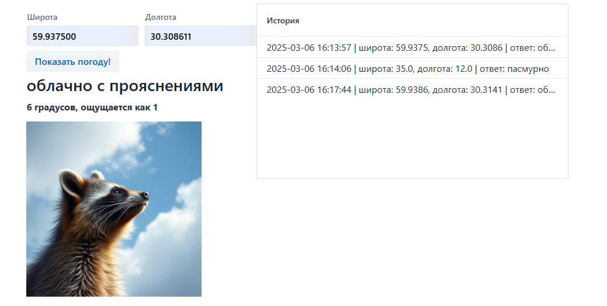

# WeatherApp

## Описание

Приложение для получения погоды по координатам

## Пример использования

**Важно!** Перед началом работы нужно получить ключ API у openweathermap. (https://home.openweathermap.org/api_keys)

Ключ необходимо указать в docker-compose.yml в поле OPENWEATHER_API_KEY=

Далее, надо запустить Docker Desktop и выполнить команду в директории приложения

```bash
docker-compose up --build
```

## Примеры работы

После запуска нужно перейти на http://localhost:8080/


Далее необходимо ввести координаты, для получения погоды

Например, координаты адмиралтейства в СПБ



В приложении реализованы различные изображения енотов для погоды (все изображения енотов созданы с помощью FLUX)

